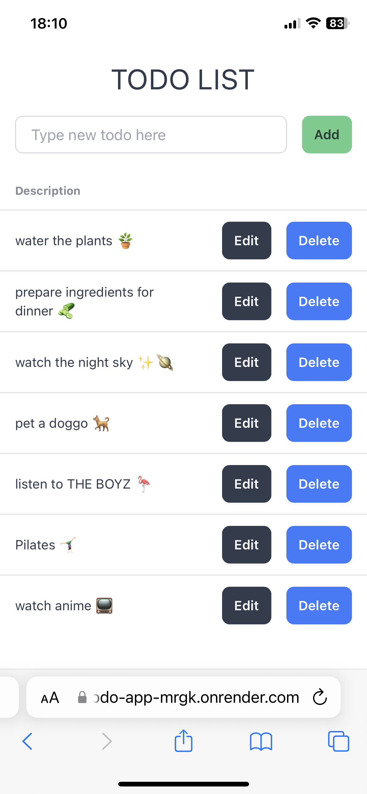
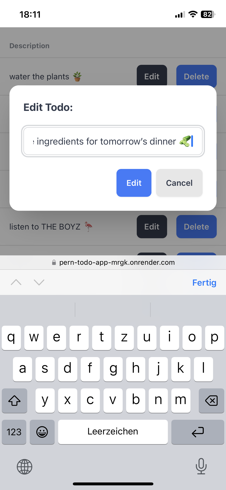
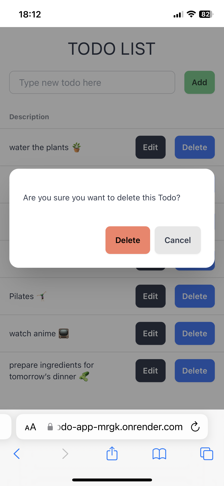
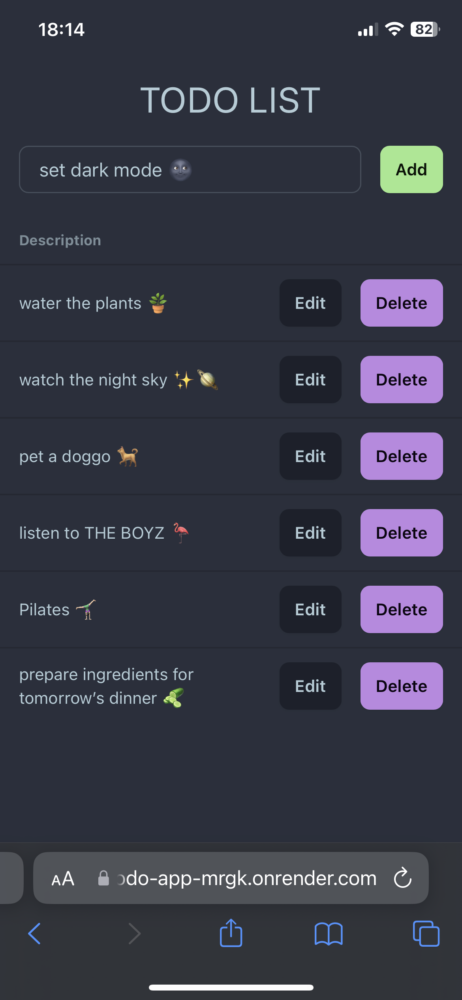
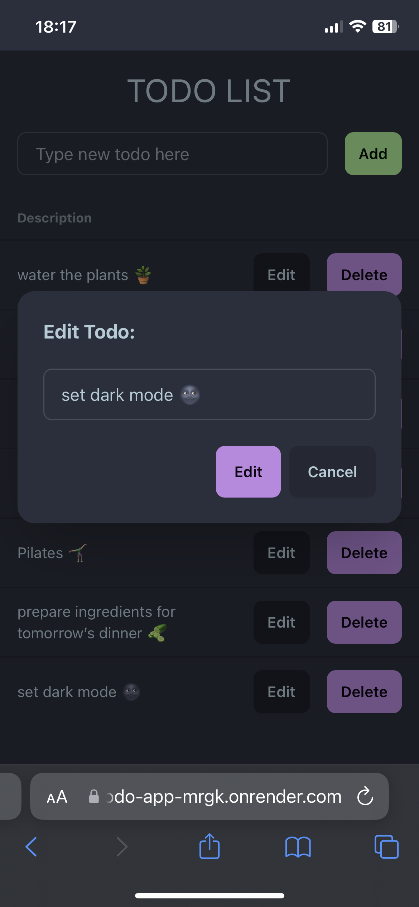
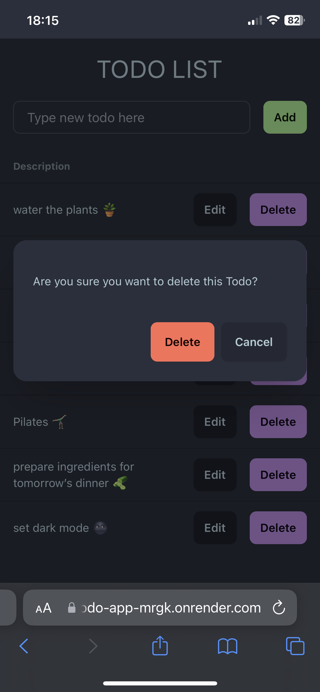

# [PERN Stack Todo-App](https://pern-todo-app-mrgk.onrender.com/) ⬅️ click for deployment

(pls be patient with the initial loading, render is sometimes slow)

## Stack

## Features

Very simple Todo App I made with the help of [this tutorial by freeCodeCamp.org](https://youtu.be/ldYcgPKEZC8?si=O_nJl19tY99hPw0Y) to learn how I can use PostgreSQL locally.

Later I deployed the app on render using their free psql database & included a dark mode with daisyui that is set according to the users system preferences rather than being toggled manually.

So basically with this app you can add/edit/delete todos and enjoy not getting blinded by the UI at night.

## Preview

<table>
<tbody>

<!--# 1. Reihe  ---------- -->
<tr>

<td align="center">

</td>

<td align="center">

</td>

<td align="center">

</td>

</tr>

<!--# 2. Reihe  ---------- -->
<tr>

<td align="center">

</td>

<td align="center">

</td>

<td align="center">

</td>

</tr>

</tbody>
</table>
